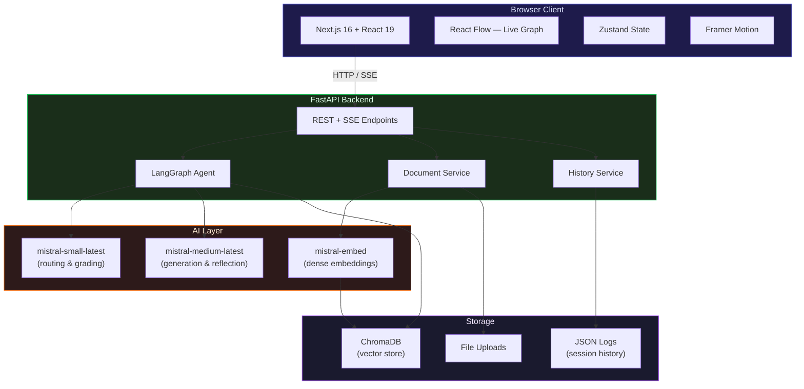
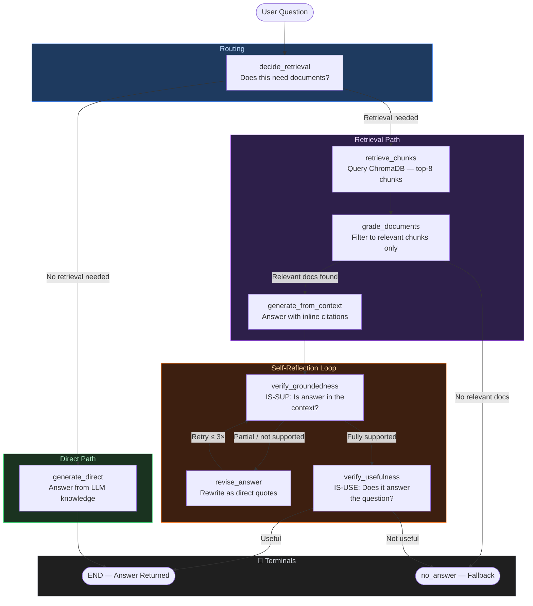
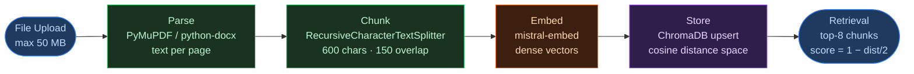

# Agentic Self-RAG Platform

An interactive, full-stack platform that implements **Self-Reflective Retrieval-Augmented Generation (Self-RAG)** and visualizes every reasoning step of the pipeline in real time. Upload your documents, ask questions, and watch the LangGraph agent think — grounding, revising, and evaluating its own answers — all streamed live to the browser.

---

## Features

- **Self-RAG graph** with 8 specialized nodes, each with a distinct role in the pipeline
- **Real-time execution visualization** via Server-Sent Events (SSE) and React Flow
- **Timeline log** with per-node latency, token counts, prompt traces, and LLM output
- **Node detail modal** — inspect the exact prompt sent and raw LLM output for any node
- **Analytics dashboard** showing cumulative stats across a session
- **Document management** — upload PDFs, DOCX, TXT, and Markdown files
- **Inline citations** — every generated answer is backed by source-referenced document chunks
- **Session history** — past executions are persisted and replayable

---

## Architecture

### System Architecture



### Tech Stack

| Layer | Technology |
|---|---|
| **Frontend** | Next.js 16, React 19, React Flow, Tailwind CSS v4, Zustand, Framer Motion |
| **Backend** | FastAPI, LangGraph, LangChain |
| **LLM** | Mistral AI (`mistral-small-latest` + `mistral-medium-latest`) |
| **Embeddings** | Mistral AI (`mistral-embed`) |
| **Vector DB** | ChromaDB (persistent, local) |

### LLM Role Split

| Model | Used For |
|---|---|
| `mistral-small-latest` | Lightweight decisions: `decide_retrieval`, `grade_documents`, `verify_groundedness`, `verify_usefulness` |
| `mistral-medium-latest` | Generation tasks: `generate_from_context`, `generate_direct`, `revise_answer` |

---

## Self-RAG Workflow

The pipeline is built as a stateful LangGraph graph. Every node emits a trace event streamed to the frontend via SSE.



### Nodes Reference

| Node | ID | Model | Role |
|---|---|---|---|
| Need Retrieval? | `decide_retrieval` | small | Determines if documents are needed or if the LLM can answer directly |
| Retrieve Documents | `retrieve` | — | Queries ChromaDB for top-8 semantically similar chunks |
| Grade Documents | `grade_documents` | small | Filters chunks — keeps only those genuinely relevant to the question |
| Generate Answer | `generate_from_context` | medium | Generates an answer using only relevant chunks; adds inline `[1]` citations |
| Generate Direct | `generate_direct` | medium | Answers general questions without retrieval |
| Grounded? | `verify_groundedness` | medium | Checks if the answer is fully supported by context (IS-SUP check) |
| Revise Answer | `revise_answer` | medium | Rewrites the answer as strict direct quotes from the context |
| Useful? | `verify_usefulness` | medium | Checks if the answer actually responds to the user's question (IS-USE check) |
| No Answer Found | `no_answer` | — | Fallback when no relevant docs or answer fails all checks |

---

## API Endpoints

| Method | Endpoint | Description |
|---|---|---|
| `POST` | `/api/upload` | Upload a document (PDF, DOCX, TXT, MD). Max 50 MB. |
| `GET` | `/api/documents` | List all ingested documents |
| `DELETE` | `/api/documents/{doc_id}` | Delete a document and its chunks |
| `POST` | `/api/query` | Run the Self-RAG pipeline; returns an SSE stream |
| `GET` | `/api/history` | List past query sessions (summary) |
| `GET` | `/api/history/{session_id}` | Get full trace for a past session |

### SSE Event Types (`POST /api/query`)

```jsonc
// Fired after each node completes
{ "event": "node_complete", "node_id": "grade_documents", "latency_ms": 420, ... }

// Fired once when the graph finishes
{ "event": "graph_complete", "answer": "...", "citations": [...], "execution_trace": [...] }

// Fired on graph error
{ "event": "graph_error", "message": "..." }
```

---

## Setup

### Prerequisites

- Python 3.10+
- Node.js 18+
- A [Mistral AI API key](https://console.mistral.ai/)

### 1. Environment Variables

```bash
cp .env.example .env
```

Edit `.env` and add your key:

```env
MISTRAL_API_KEY=your_mistral_api_key_here
ANONYMOUS_TELEMETRY=False
```

### 2. Backend

```bash
cd backend

# Create and activate virtual environment
python -m venv venv
source venv/bin/activate        # Windows: venv\Scripts\activate

# Install dependencies
pip install -r requirements.txt

# Start the API server
uvicorn main:app --reload
```

The backend runs on **http://localhost:8000**. Interactive API docs are available at **http://localhost:8000/docs**.

### 3. Frontend

```bash
cd frontend
npm install
npm run dev
```

Open **http://localhost:3000**.

---

## Document Ingestion

Supported formats: **PDF**, **DOCX**, **TXT**, **Markdown**



Retrieval uses cosine similarity, returning top-8 chunks. Similarity is normalized from ChromaDB's cosine distance: `score = 1 − (distance / 2)`, giving a `[0, 1]` range.

---

## Key Design Decisions

- **SSE over WebSockets**: Server-Sent Events provide a simpler, unidirectional push channel sufficient for streaming trace events from the graph to the browser.
- **Accumulated state in SSE stream**: LangGraph's `stream()` yields only partial updates per node. The backend accumulates all node outputs into a single `accumulated_state` dict so that keys set by early nodes (e.g., `answer`) are not lost when later nodes (e.g., `verify_usefulness`) don't return them.
- **Dual-model strategy**: Lightweight decisions (grading, routing) use `mistral-small-latest` for cost efficiency; generation and self-reflection use `mistral-medium-latest` for quality.
- **Global `NodeDetailModal`**: Mounted at the root layout so it is accessible from both the Execution Graph and Timeline Log tabs without relying on which visualization is currently mounted.
- **ChromaDB telemetry disabled**: `anonymized_telemetry=False` in `Settings` and `ANONYMOUS_TELEMETRY=False` in `.env` suppress noisy telemetry warnings from ChromaDB's PostHog integration.
